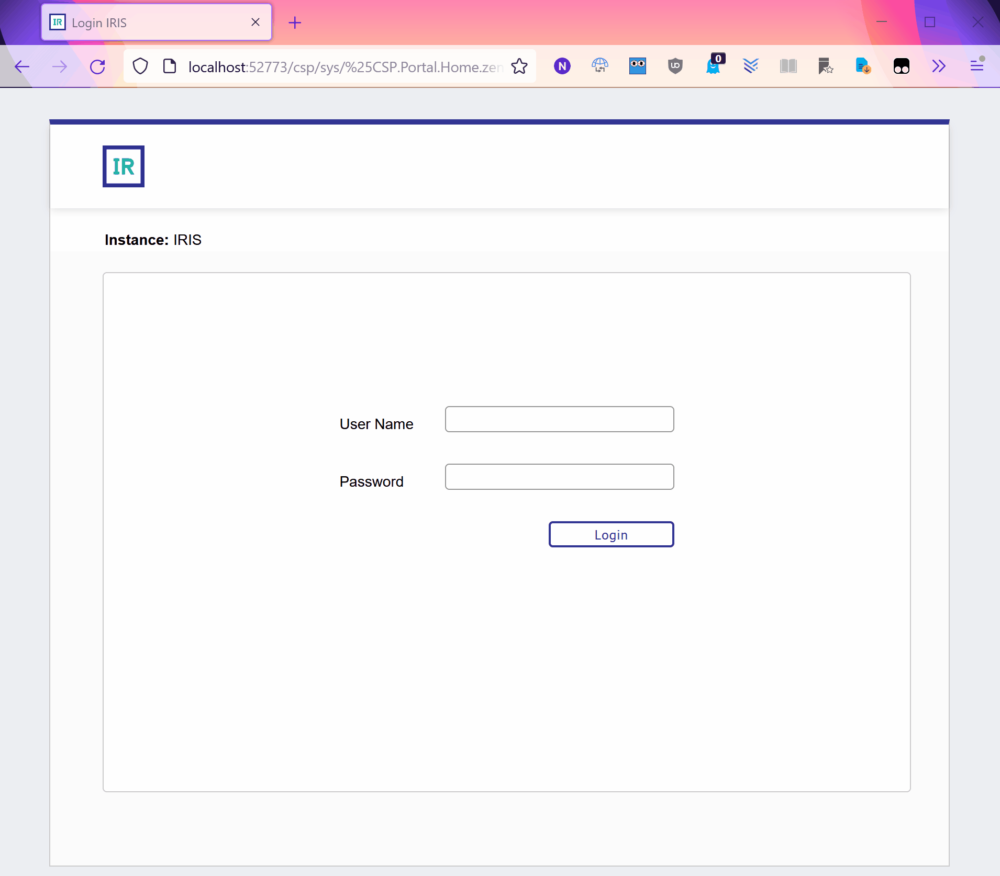

# IRIS container with vscode

> InterSystems IRIS container with vscode and pre-connected

| Cred         | Value    |
|--------------|:--------:|
| User         |  _SYSTEM |
| Password     |  SYS     |



## Overview

This project creates an IRIS container with a hosted (web-based) version of vscode available in the same IRIS container. This provides:
* Same container code editing
* Pre-connection to the container's IRIS instance
* Links from the Management Portal
* Auto starting IDE with the container

# Quick Start

1. [Download](https://github.com/nickmitchko/Hosting-vscode-in-a-container/archive/refs/heads/master.zip) or `git clone https://github.com/nickmitchko/Hosting-vscode-in-a-container.git` this repository
2. In the root of the project, run `docker build . -t vscode-irishealth-ml:latest --no-cache`
3. Run `docker-compose up`
    * Not using docker compose? See [here](#No-Docker-Compose)
4. Navigate to [Management Portal](http://localhost:52773/csp/sys/%25CSP.Portal.Home.zen)
5. Login with the user and password near the top of this guide
6. Click VSCODE Link on the favorites pane
7. When prompted use the same password in vscode to connect to the IRIS instance.

```bash
# New folder for project
mkdir vscode-iris
cd vscode-iris

# Clone repo here
git clone https://github.com/nickmitchko/Hosting-vscode-in-a-container.git .

# Build image
docker build . -t vscode-irishealth-ml:latest --no-cache

# Only Run (A) or (B)
#
# (A) Run compose file
docker-compose up
# OR (B) if you want a daemon
docker-compose up -d
```

## Adding Persistence

If you want a persistent iris instance, un comment lines 16-20 in docker-compose.yml file. This adds a persistent storage mount to the container.

```yml
    volumes:
    - "./durable/:/durable/"
    environment:
    - ISC_DATA_DIRECTORY=/durable/iconfig
```

## Changing the base image

This image is built upon the InterSystems Developer Community zpm images ([found here](https://hub.docker.com/r/intersystemsdc/iris-community/tags)). These images include the zpm command which allows up to install from the package repository easily, but only has a community license of 90 days.

The image tag used for builds is:
```dockerfile
FROM intersystemsdc/irishealth-ml-community:latest
```

If you want to change the image, change the first line of the docker file to your desired image tag (either a custom IRIS instance or a [supported one](https://docs.intersystems.com/components/csp/docbook/DocBook.UI.Page.cls?KEY=PAGE_containerregistry#PAGE_containerregistry_public)). For example:
```dockerfile
FROM containers.intersystems.com/intersystems/irishealth-community:2021.2.0.651.0
```

# No Docker-Compose

If you're not using docker compose, you can still run the container as follows:

```bash
# After building the container
# --after command is required
docker run --name vscode -d \
    --publish 1972:1972 \
    --publish 52773:52773 \
    --publish 51773:51773 \
    --publish 53773:53773 \
    --publish 8080:8080 \
    --publish 8888:8888 \
    vscode-irishealth-ml:latest \
    --after "/bin/bash /install/boot.sh"
```